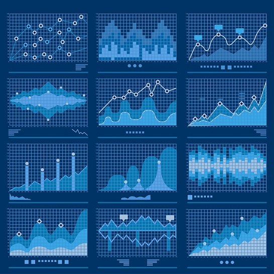
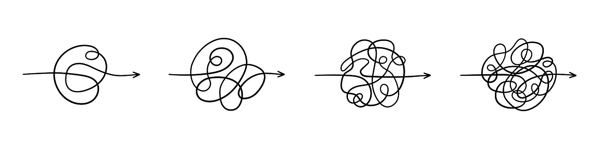
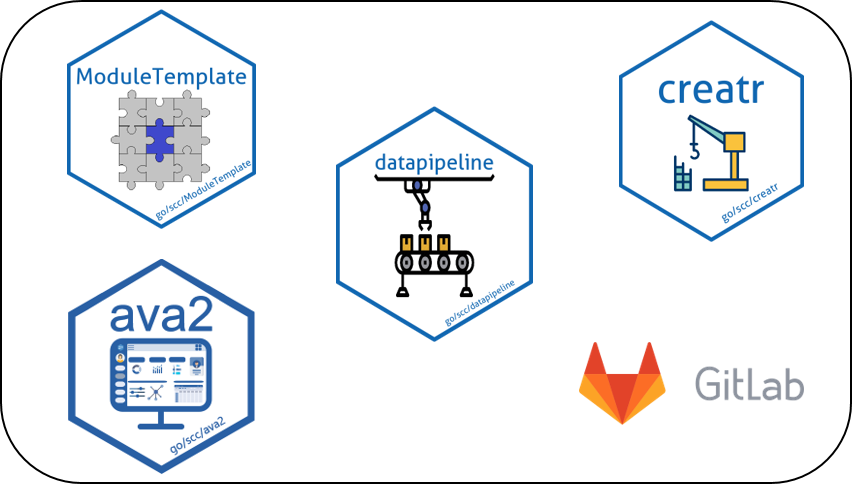
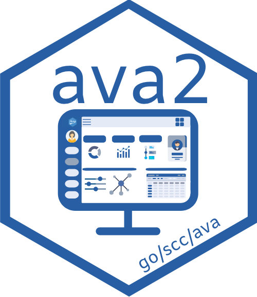
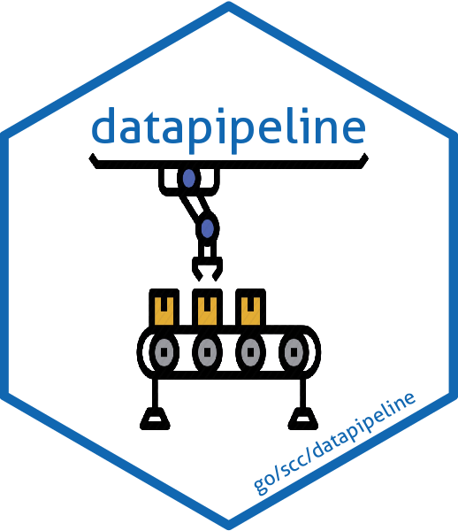
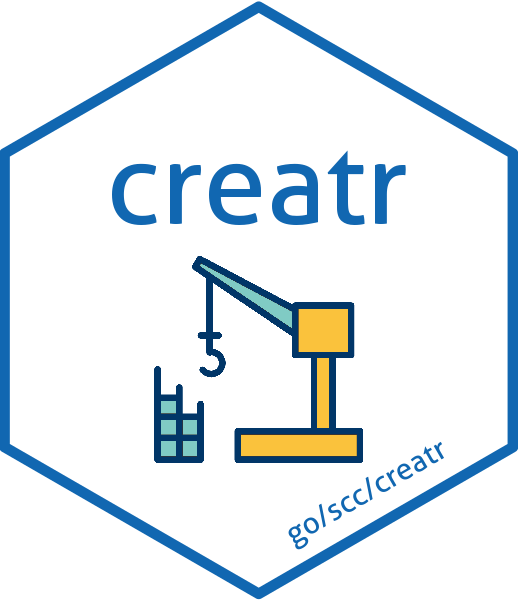
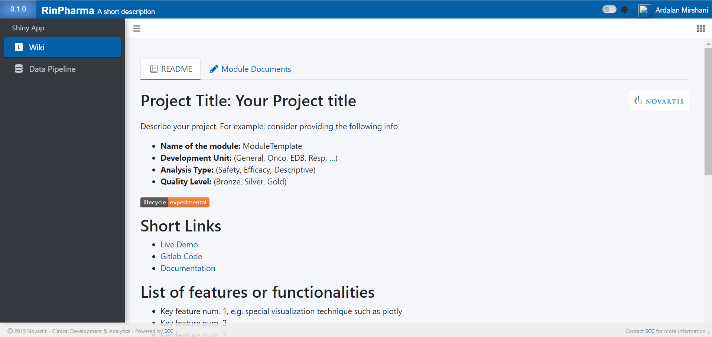
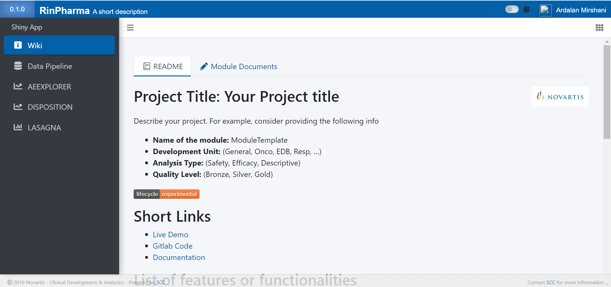
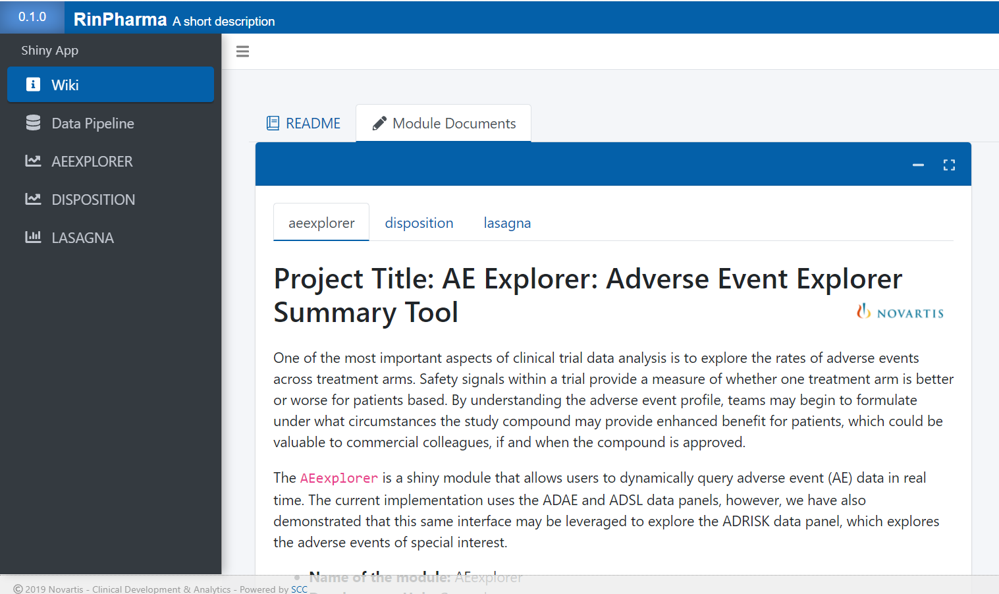
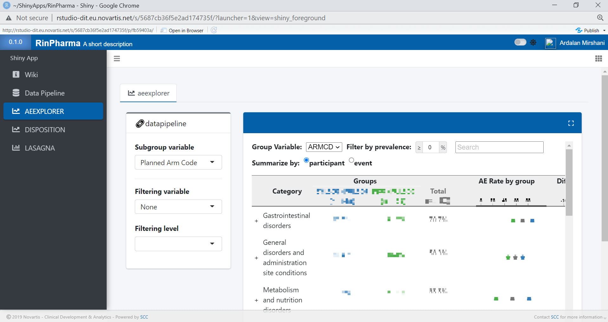

class: center, middle, back-darkblue


# Democratizing Shiny App Development

### The Novartis DataPipeline Harmonized Framework
<br>

#### Ardalan Mirshani
#### Data Scientist, Novartis

##### 11-03-2021

```{r setup, include=FALSE}
library(emo)
library(shiny)
library(countdown)
library(dplyr)
library(purrr)
options(htmltools.dir.version = FALSE)
knitr::opts_chunk$set(
  fig.width = 10, fig.height = 6, fig.retina = 2,
  warning = FALSE, message = FALSE
)

#xaringanExtra::use_search(show_icon = TRUE)
xaringanExtra::use_tile_view()
xaringanExtra::use_share_again()
xaringanExtra::use_clipboard()
xaringanExtra::use_tachyons()

xaringanExtra::use_extra_styles(
  hover_code_line = TRUE,         #<<
  mute_unhighlighted_code = TRUE  #<<
)
xaringanExtra::use_panelset()
```

```{r js4shiny, echo=FALSE}
js4shiny::html_setup(stylize = c("fonts", "variables", "code"))
```


---
class: header_background
# Motivation

.pull-left[
<br>
<br>
- Rapid Rise in __Clinical Data Exploration__

- Increasing need to utilize interactive graphical displays 

- Building __Shiny Apps__

]

.pull-right[
<br>
<br>
```{r, echo = FALSE, out.width='85%', fig.align='center'}

```
]


---
class: header_background
# Challenges:

.pull-left[

- __Time__ and __Knowledge__

  - Learning about Data Repo, Environments, Tools

- __Maintainability__ 

  - Developed apps inconsistently

- __Reusability__

  - Hard-Coded
  
  - Lack of Doc

]


.pull-right[
<br>
```{r, echo = FALSE, out.width='110%', fig.align='center'}

```

```{r, echo = FALSE, out.width='72%', fig.align='center'}

```
]


---
class: header_background
# Goal 

<span style="font-size: 36px;">__Scale__ <span style="color: #4d8dc9;">the use of professional shiny apps across the portfolio</span></span>

- Professional look and feel

- High quality

- Generalizable, Extensible, and Upgradable

- Reusable

- Automated


---
class: header_background
# .small[Solution : Datapipeline harmonized framework]

<br>

A __modularized ecosystem__ to standardize development and deployment of shiny apps

- __Enabling__ teams to use __best practice templates__ compliant with the company infrastructure

- __Empowering__ the community to develop their own tools and __share__ with others


- __Automate__ the repetitive tasks that arise during project setup and development


???
class: header_background
# What is the Datapipeline Framework? 


- A __modularized platform__ to standardize development and deployment

- Rapid __automation__ and creation of professional visualization tools

- __Enabling__ teams to open source their projects using __best practice templates__

- __Empowering__ the community to develop their own tools and __share__ with others


---
class: center header_background middle
# Our Architecture

```{r, echo = FALSE, out.width='80%', fig.align='center'}

```


---
class: header_background
# datapipeline harmonized framework

.pull-left[
<br>
<br>
```{r, echo = FALSE, out.width='72%', fig.align='center'}

```
]

.pull-right[
<br>
<br>
- Modern __Toolkit__ compliant with the company brand lab

- Professional __UI Templates__ for Shiny App

- Authentication

- Tracking

- Authorization

]


---
class: header_background
# datapipeline harmonized framework

.pull-left[
<br>
<br>
```{r, echo = FALSE, out.width='72%', fig.align='center'}

```
]

.pull-right[
<br>
<br>

- A framework for standardizing the __data preparation__ process

- __Data loading__ from the company Data repository

- Data __configuration__ and __pre-processing__
]


---
class: header_background
# datapipeline harmonized framework

.pull-left[
<br>
<br>
```{r, echo = FALSE, out.width='72%', fig.align='center'}

```
]

.pull-right[
<br>
<br>
- A __workflow__ R-pkg that fully __automates__ the repetitive tasks

  - shiny app setup
  
  - adding modules
  
  - deployment
  
  - upgrading app
  

- __No need__ to have __Knowledge__ on Shiny


- {creatr} is __chatty__

]


---
class: header_background
# datapipeline harmonized framework

.pull-left[
<br>
<br>
```{r, echo = FALSE, out.width='72%', fig.align='center'}

```
]

.pull-right[
<br>
<br>

- A best practice __template__ for creating professional shiny modules
  
  - __R-pkg__ format: motivated by {__golem__}
  
  - Compliant with the company infrastructure: {__datapipeline__} & {__ava2__}
  
]


---
class: header_background
# Setup with {ModuleTemplate}
.pull-left[
<br>
<iframe width="815" height="315" src="./assets/movies/Import_modtemplate.mp4" frameborder="0" controls="" allowfullscreen ></iframe>
]

.pull-right[
<br>
<br>

```{r, echo=T, eval=F}
library(creatr)
import_module_crtr()
```


]

---
class: header_background
# {ModuleTemplate} User Interface

- Here is the place to start __developing__ a module!
   - __+30 modules__ have been created by our community
  
```{r, echo = FALSE, out.width='80%', fig.align='center'}

```


---
class: center title-slide middle
# Automatically build an app by connecting modules

```{r, echo = FALSE, out.width='40%', fig.align='center'}

```


---
class: header_background
# Module components

#### Here is the required module information for including to the __automated__ framework

.pull-left[
### 1. config file:
  
  - meta data
  
  - domain dependencies
  
  - pkg dependencies

### 2. R scripts

 - Module
]

.pull-right[
### 3. documentation

### 4. vignettes

### 5. data
]


---
class: header_background
# Build the app automatically
.pull-left[
<br>
<iframe width="815" height="315" src="./assets/movies/creatr_import_module.mp4" frameborder="0" controls="" allowfullscreen ></iframe>
]

.pull-right[
<br>
<br>

```{r, echo=T, eval=F}
library(creatr)
import_module_crtr()
```

```{r, echo = FALSE, out.width='75%', fig.align='center'}

```

]


---
class: header_background
#  A quick tour on the app

<br>
```{r, echo = FALSE, out.width='100%', fig.align='center'}

```


---
class: header_background
# A quick tour on the app: documentation

<br>
```{r, echo = FALSE, out.width='80%', fig.align='center'}

```


---
class: header_background
# A quick tour on the app: modules
<br>
```{r, echo = FALSE, out.width='90%', fig.align='center'}

```


---
class: header_background
# Impact & Summary

- ⏱️ Teams can create a professional shiny app in __couple of seconds__

- 📚 Guided Codes and Documentation were provided to __customize__ and __extend__ the app

- We leverage a __community-based platform__ that developers focus on developing __reusable__ modules and easily __share__ with others.

- As the app creation does __not need knowledge on shiny__, many groups became interested to have an app for their own studies 
  - __+330 apps__ created in the last 5 months

.bg-washed-green.b--dark-green.ba.bw2.br3.shadow-5.ph4[
🔥 By __scaling__ the app creation, we __envision__ having an exploratory shiny app for every single clinical study.
]

???
class: header_background
# Summary

__Datapipeline Harmonized Frameowrk__ is an opinionated ecosystem that __scale__ the shiny app creation across the portfolio

- __Rapidly__ build a professional shiny app

- __Automate__ the process and __No need__ to have __knowledge__ on shiny

- Empower developers to easily __share__ their modules with others

- Keep the app __generalizable__ and __reusable__

---
class: inverse center title-slide middle
# Thank You

